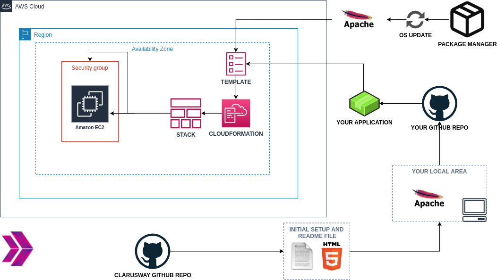
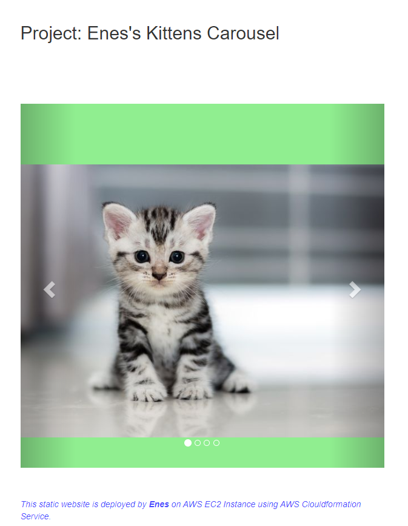

# Kittens Carousel Static Website deployed on AWS EC2 using Cloudformation

## Description

Kittens Carousel is a static website application deployed with Apache Web Server on AWS Elastic Compute Cloud (EC2) Instance using AWS Cloudformation Service.

## Problem Statement

- Your company has recently started a web application project that will serve as an attraction point for pet lovers. As a first step of the project, developers in your team have prepared a preliminary design of kittens carousel application and pushed necessary files for the project to the repository on Github.

- Your task is to show the how the design of application looks as static web page in the development environment. Thus, you need to deploy the web application using the `index.html` and an images given within the `static-web` folder. Note the followings for your web application.

  - User should face first with `index.html` when web app started.

  - Application should be deployed on Apache Web Server.

  - Application should be deployed in the development environment on AWS EC2 Instance using AWS Cloudformation Service. In the development environment, you can configure your Cloudformation template using the followings,

    - The application stack should be created with new AWS resources.

    - The application should run on Amazon Linux 2 EC2 Instance

    - EC2 Instance type can be configured as `t2.micro`.

    - Instance launched by Cloudformation should be tagged `Web Server of StackName`

    - The Web Application should be accessible via web browser from anywhere.

    - The Application files should be downloaded from Github repo and deployed on EC2 Instance using user data script within cloudformation template.

    - Kittens Carousel Application Website URL should be given as output by Cloudformation Service, after the stack created.

<<<<<<< HEAD
## Expected Outcome

=======
## Outcome

>>>>>>> 9315e48a60a643f9105f1f70ede7041f4e982238

### At the end of the project, following topics are to be covered;

- Apache Web Server Installation on Linux

- Static Website Deployment

- Bash scripting

- AWS EC2 Service

- AWS Security Groups Configuration

- AWS Cloudformation Service

- AWS Cloudformation Template Design

- Git & Github for Version Control System

## Resources

- [AWS Cloudformation User Guide](https://docs.aws.amazon.com/AWSCloudFormation/latest/UserGuide/Welcome.html)
